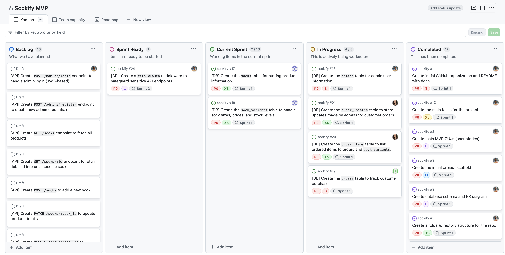
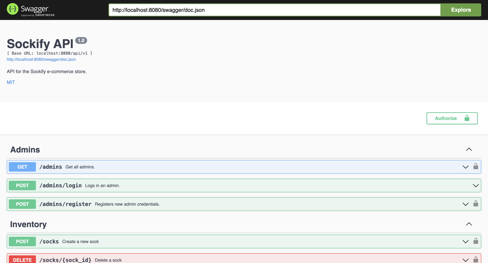
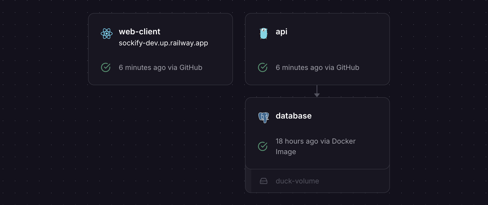

# Sockify <!-- omit in toc -->

An e-commerce web app to sell custom socks.

**Production**

- **Store:** <https://sockify.up.railway.app>
- **Admin dashboard:** <https://sockify.up.railway.app/admin>
- **API docs:** <https://sockify-api.up.railway.app/swagger/index.html>

**Development**

- **Store:** <https://sockify-dev.up.railway.app>
- **Admin dashboard:** <https://sockify-dev.up.railway.app/admin>
  - **Username:** `jdoe`
  - **Password:** `password`
  - **Credit card (fake):** `4242 4242 4242 4242`
- **API docs:** <https://sockify-api-dev.up.railway.app/swagger/index.html>

**Core team:** [Abel Aguillera](https://www.linkedin.com/in/abel-aguilera-09b65b249/), [Bora Dibra](https://www.linkedin.com/in/bora-dibra/), [Charlotte Williams](https://www.linkedin.com/in/charlotte-williams-761510185/), [Sebastian Nunez](https://www.linkedin.com/in/sebastian-nunez-profile/)

## Table of contents <!-- omit in toc -->

- [Tech stack](#tech-stack)
- [Project board](#project-board)
- [Getting started](#getting-started)
  - [Running locally](#running-locally)
  - [Database migrations](#database-migrations)
  - [Swagger UI](#swagger-ui)
  - [Deployment (Railway)](#deployment-railway)

## Tech stack

- **Frontend**
  - **Languages:** [TypeScript](https://www.typescriptlang.org/)
  - **Frameworks:** [React](https://react.dev/) (w/ [Vite](https://vitejs.dev/))
  - **UI components:** [ShadCN UI](https://ui.shadcn.com/), [TailwindCSS](https://tailwindcss.com/)
  - **Icons:** [Lucide Icons](https://lucide.dev/icons/)
  - **Data fetching/caching:** [React Query](https://tanstack.com/query/latest/docs/framework/react/overview), [Axios](https://axios-http.com/docs/intro)
  - **Form validation:** [React Hook Form](https://react-hook-form.com/), [Zod](https://zod.dev/)
  - **Notifications/toasts:** [React Hot Toast](https://react-hot-toast.com/)
- **Backend:**
  - **Languages:** [Go](https://go.dev/)
  - **Authentication:** [JSON Web Tokens (JWT)](https://jwt.io/)
  - **Payment processing:** [Stripe](https://stripe.com/)
  - **Blob storage:** [Firebase](https://firebase.google.com/)
  - **API Specification (UI):** [OpenAPI (Swagger)](https://github.com/swaggo/swag?tab=readme-ov-file)
  - **Email client:** [SendGrid](https://sendgrid.com/)
- **Database:** [PostgreSQL](https://www.postgresql.org/)
- **Hosting:** [Railway](https://railway.app/), [Docker Compose](https://docs.docker.com/compose/)
- **Design:** [Figma](https://figma.com/)

## Project board

We are tracking our progress, working items, and milestones through the [Sockify MVP](https://github.com/orgs/sockify/projects/1/views/1) GitHub project board.



## Getting started

### Running locally

1. Clone the repository locally: `git clone https://github.com/sockify/sockify`
2. Make sure you have the latest version of [Docker Desktop](https://docs.docker.com/engine/install/) installed
3. Run and build the app: `docker compose up --build --watch`
   1. As changes are detected, the Docker images will be rebuilt automatically

#### Good to know <!-- omit in toc -->

- You can access the web UI: http://localhost:5173/
- You can acccess the Swagger UI (API): http://localhost:8080/swagger/index.html
- To lint (`npm run lint:fix`) and format (`npm run prettier:fix`) the `web-client`, you have to first `cd web-client`, then run `npm install`.
- If you run into issues with the Docker build: open Docker Desktop, then stop all the services, then delete all the containers, and lastly, delete all the volumes and try again.

### Database migrations

We are using [golang-migrate](https://github.com/golang-migrate/migrate/tree/master) to ease all database migrations in the API. To use the commands below, make sure to:

1. Download the migration CLI from [here](https://github.com/golang-migrate/migrate/blob/master/cmd/migrate/README.md)
2. Make your current working directory (CWD) is `/api`: `cd api`

#### Create a migration <!-- omit in toc -->

To create a new database migration, run:

```bash
make migration <migration-name-separated-by-underscores>
```

You can find the newly created migration scripts at `./api/cmd/migrate/migrations`.

_Make sure to include the **"up"** (creation) and **"down"** (teardown) scripts!_

#### Applying all database migration <!-- omit in toc -->

To apply all existing database migrations, run:

```bash
make migrate-up
```

#### Turning down database migrations <!-- omit in toc -->

To remove all database migrations, run:

```bash
make migrate-down
```

### Swagger UI

We are using [Swagger UI](https://swagger.io/tools/swagger-ui/) to access our API endpoints through a UI in the browser.

You can open the local API docs at http://localhost:8080/swagger/index.html



#### Generating the docs <!-- omit in toc -->

Whenever changes are made to API, we have to re-build the API specification.

We are using [Swaggo](https://github.com/swaggo/swag?tab=readme-ov-file) to automatically generate an [OpenAPI](https://www.openapis.org/) spec. These are the steps needed:

1. Install the `swag` CLI: `go install github.com/swaggo/swag/cmd/swag@latest`
2. To use the CLI command, make sure Go is in your system path (inside your `~/.bashrc` or `~/.zshrc` file for UNIX):

   ```bash
   export PATH=$(go env GOPATH)/bin:$PATH
   ```

   Otherwise, you will probably see an error like: `zsh: command not found: swag`

3. Open the `/api` directory: `cd api`

4. Run the following command: `make swag` (OR `swag init -g ./cmd/main.go -o ./docs`)

### Deployment (Railway)

We are using [Railway](https://railway.app/) to deploy our application.



#### Architecture <!-- omit in toc -->

Within our [Railway project](https://railway.app/project/de4acaa6-0fa7-45f2-a7d2-938b9a5b9151), we have configured two _independent_ deployment environments: [`dev`](https://sockify-dev.up.railway.app) and [`production`](https://sockify.up.railway.app).

Both of these environments have their own `web-client`, `api`, and `database` instances.

#### Autodeploys through GitHub <!-- omit in toc -->

We have configured [GitHub autodeploys](https://docs.railway.app/guides/github-autodeploys) within Railway. So, we do not need to worry about manually redeploying changes.

**Note:** changes involving database schema changes/migrations, will need to be _manually_ applied to all relevant Railway databases. (see the `Running database migrations` section)

_For the most part, redeployments should only take a few minutes._

##### Deploy branch structure <!-- omit in toc -->

- Commits pushed to `main` will be autodeployed to `production`
- Commits pushed to `develop` will be autodeployed to `dev`

##### Manual deployments through the CLI <!-- omit in toc -->

We can manually deploy using the Railway CLI. This is not needed but in case of an emergency, here are the steps:

1. Download and install the CLI: `npm i -g @railway/cli`
2. Login through the CLI: `railway login`
3. Connect to our project: `railway link -p de4acaa6-0fa7-45f2-a7d2-938b9a5b9151`
4. Deploy the branch: `railway up`
   1. Make sure to associate the deployment with the correct environment (e.g. `production`, `dev`) and the correct service (e.g. `web-client`, `api`)

#### Docker-compose caveat <!-- omit in toc -->

Turns out [Railway does NOT support `docker-compose`](https://docs.railway.app/guides/dockerfiles#docker-compose). As a result, we are unable to simply use our local development workflow.

Instead, Railway will use our `Dockerfiles` to independently build the `web-client` and `api`.

Also, we have to host our own `PosgreSQL` database within Railway and link it to our `api` server via [shared reference environment variables](https://docs.railway.app/guides/variables#reference-variables).

##### Running database migrations <!-- omit in toc -->

To run the migrations to a particular database, run the following command using the correct database connection URL from Railway:

Run all migrations:

`migrate -path ./api/cmd/migrate/migrations -database <Railway database URL> up`

_You can download the `migrate` CLI from [here](https://github.com/golang-migrate/migrate/blob/master/cmd/migrate/README.md)_
