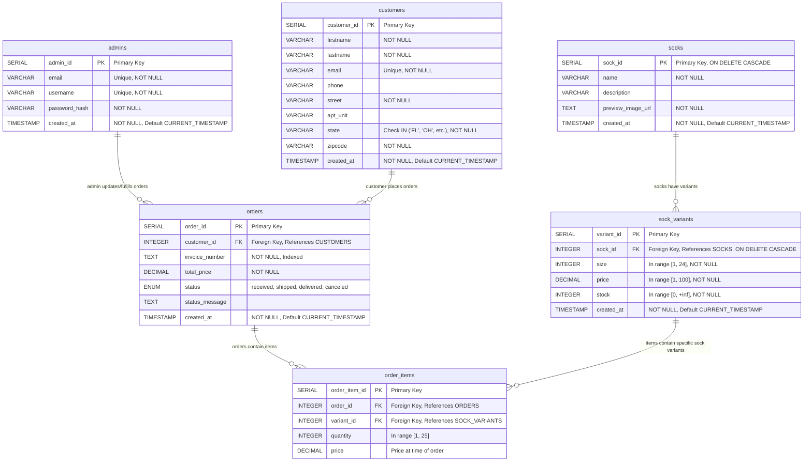

# Entity-relationship (ER) diagram

```mermaid
erDiagram
    admins {
        SERIAL admin_id PK "Primary Key"
        VARCHAR email "Unique, NOT NULL"
        VARCHAR username "Unique, NOT NULL"
        VARCHAR password_hash "NOT NULL"
        TIMESTAMP created_at "NOT NULL, Default CURRENT_TIMESTAMP"
    }

    customers {
        SERIAL customer_id PK "Primary Key"
        VARCHAR firstname "NOT NULL"
        VARCHAR lastname "NOT NULL"
        VARCHAR email "Unique, NOT NULL"
        VARCHAR phone
        VARCHAR street "NOT NULL"
        VARCHAR apt_unit
        VARCHAR state "Check IN ('FL', 'OH', etc.), NOT NULL"
        VARCHAR zipcode "NOT NULL"
        TIMESTAMP created_at "NOT NULL, Default CURRENT_TIMESTAMP"
    }

    socks {
        SERIAL sock_id PK "Primary Key, ON DELETE CASCADE"
        VARCHAR name "NOT NULL"
        VARCHAR description
        TEXT preview_image_url "NOT NULL"
        TIMESTAMP created_at "NOT NULL, Default CURRENT_TIMESTAMP"
    }

    sock_variants {
        SERIAL variant_id PK "Primary Key"
        INTEGER sock_id FK "Foreign Key, References SOCKS, ON DELETE CASCADE"
        INTEGER size "In range [1, 24], NOT NULL"
        DECIMAL price "In range [1, 100], NOT NULL"
        INTEGER stock "In range [0, +inf], NOT NULL"
        TIMESTAMP created_at "NOT NULL, Default CURRENT_TIMESTAMP"
    }

    orders {
        SERIAL order_id PK "Primary Key"
        INTEGER customer_id FK "Foreign Key, References CUSTOMERS"
        TEXT invoice_number "NOT NULL, Indexed"
        DECIMAL total_price "NOT NULL"
        ENUM status "received, shipped, delivered, canceled"
        TEXT status_message ""
        TIMESTAMP created_at "NOT NULL, Default CURRENT_TIMESTAMP"
    }

    order_items {
        SERIAL order_item_id PK "Primary Key"
        INTEGER order_id FK "Foreign Key, References ORDERS"
        INTEGER variant_id FK "Foreign Key, References SOCK_VARIANTS"
        INTEGER quantity "In range [1, 25]"
        DECIMAL price "Price at time of order"
    }

    admins ||--o{ orders : "admin updates/fufills orders"
    customers ||--o{ orders : "customer places orders"
    socks ||--o{ sock_variants : "socks have variants"
    orders ||--o{ order_items : "orders contain items"
    sock_variants ||--o{ order_items : "items contain specific sock variants"
```
