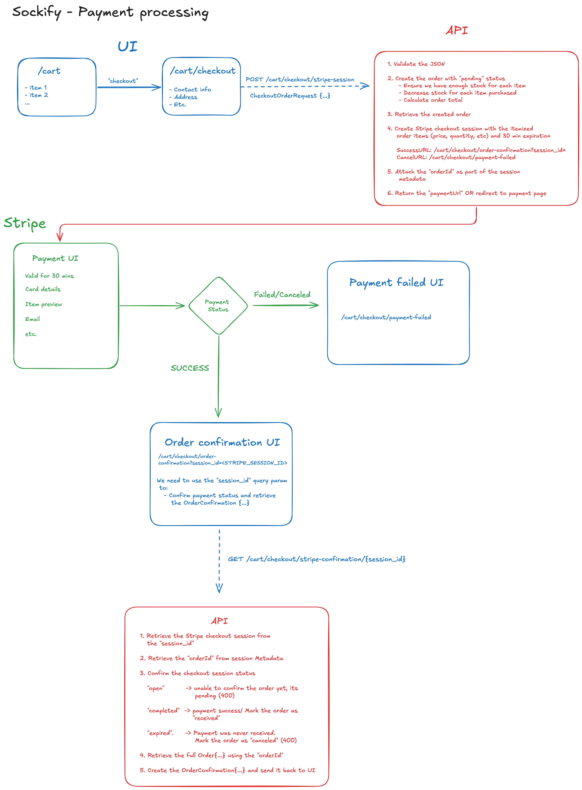

# Payment processing/checkout with Stripe <!-- omit in toc -->

## Table of contents <!-- omit in toc -->

- [Flow diagram](#flow-diagram)
- [API Endpoints and payloads](#api-endpoints-and-payloads)
  - [`POST /cart/checkout/stripe-session`](#post-cartcheckoutstripe-session)
  - [`GET /cart/checkout/stripe-confirmation/{session_id}`](#get-cartcheckoutstripe-confirmationsession_id)

## Flow diagram



## API Endpoints and payloads

### `POST /cart/checkout/stripe-session`

Will be used to create a Stripe checkout session after the "pending" order has been created.

**Request (`CheckoutOrderRequest`):**

```jsonc
{
  "address": {
    "aptUnit": "string",
    "city": "string",
    "state": "string",
    "street": "string",
    "zipcode": "string"
  },
  "contact": {
    "email": "string",
    "firstname": "string",
    "lastname": "string",
    "phone": "string"
  },
  "items": [
    {
      "quantity": 1,
      "sockVariantId": 0
    }
  ]
}
```

**Response (`StripeCheckoutResponse`):**

```jsonc
{
  "paymentUrl": "https..."
}
```

### `GET /cart/checkout/stripe-confirmation/{session_id}`

Will be used to validate the payment status for the associated Stripe checkout `session_id`.

**Response: (`OrderConfirmation`)**

```jsonc
{
  "address": {
    "aptUnit": "string",
    "city": "string",
    "state": "string",
    "street": "string",
    "zipcode": "string"
  },
  "createdAt": "string",
  "invoiceNumber": "string",
  "items": [
    {
      "name": "string",
      "price": 0,
      "quantity": 0,
      "size": "string",
      "sockVariantId": 0
    }
  ],
  "status": "string",
  "total": 0
}
```
